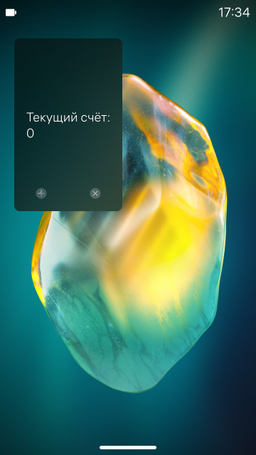
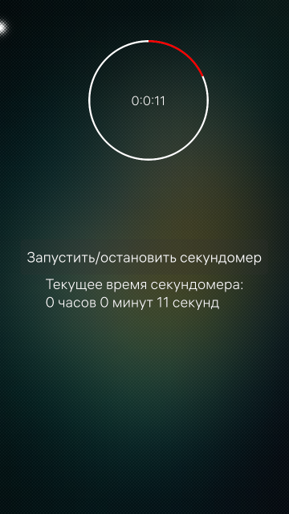
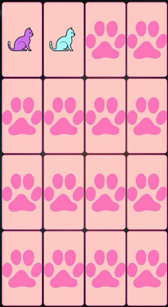

# Aurora_labs

## Задачи

Были выполнены следующие задачи:

  - [x] Посмотреть возможности среды Qt Creator и эмулятора;
  - [x] Освоить базовые навыки построения пользовательских интерфейсов, позиционирования, отрисовки и перемещения элементов;
  - [x] Научиться анимировать элементы;
  - [x] Научиться создавать диалоги и взаимодействовать с ними;
  - [x] Научиться применять типовые элементы интерфейса Sailfish OS;
  - [x] Научиться организовывать многостраничное приложение;
  - [x] Научиться использовать контейнеры Silica, вытягиваемые меню и обложку приложения;
  - [x] Научиться использовать различные модели для отображения данных в прокручиваемых списках; 
  - [x] Научиться взаимодействовать с базой данных и управлять настройками приложения;
  - [x] Научиться создавать пользовательский интерфейс конфигурируемый состояниями, реализовывать анимированные переходы при смене состояний;
  - [x] Научиться создавать собственные QML компоненты;
  - [x] Научиться использовать C++ классы в QML;
  - [x] Научиться писать собственные QML компоненты на языке C++ и использовать их в приложении;
  - [x] Научиться использовать объект Canvas для рисования;
  - [x] Освоить реализацию анимации с помощью спрайтов;
  - [x] Научиться использовать частицы для создания визуальных эффектов;
  - [x] Изучить объекты мультимедиа для встраивания музыки и видео в приложение;
  - [x] Подтвердить полученные навыки работы с пользовательским интерфейсом и QML компонентами.

## Примеры

## Игра "Найди пару"

